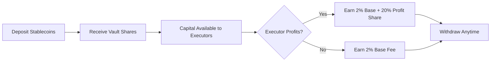
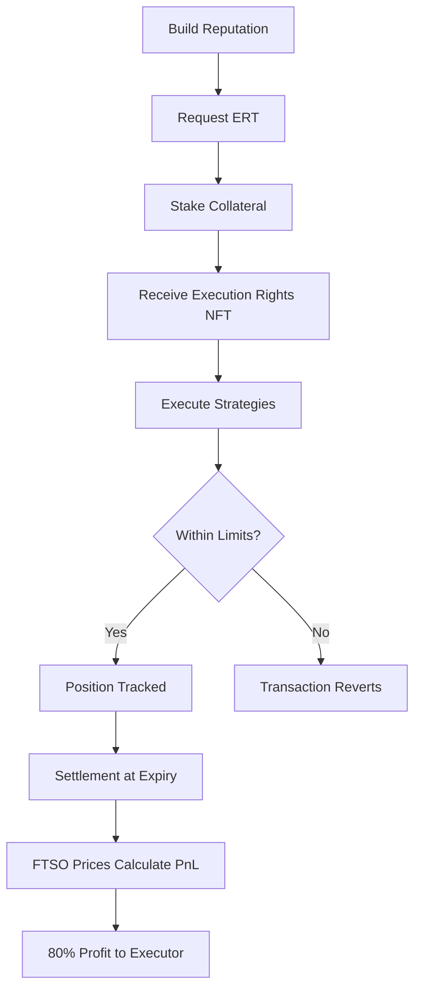
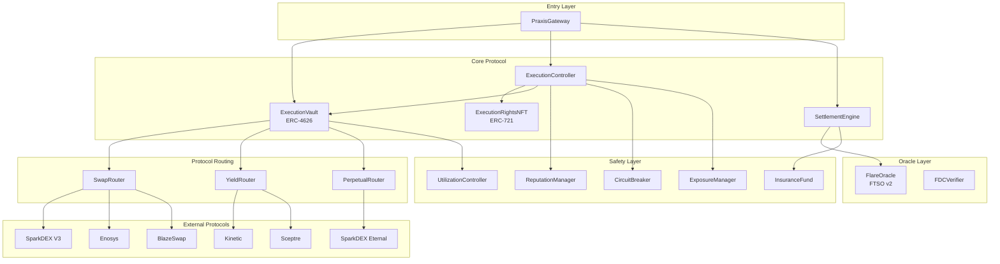
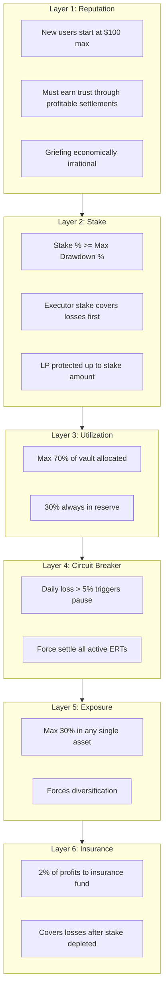
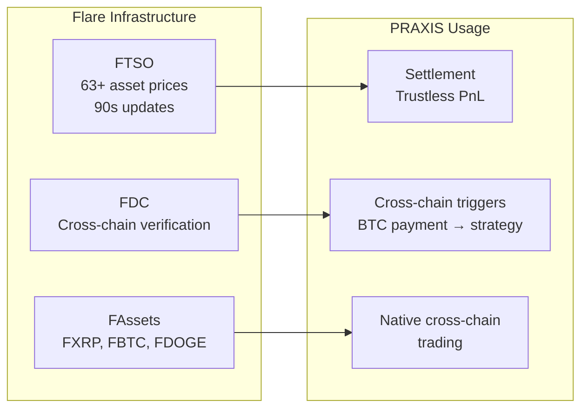
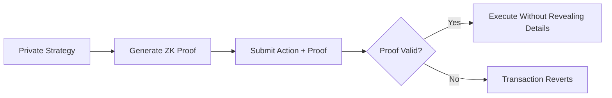
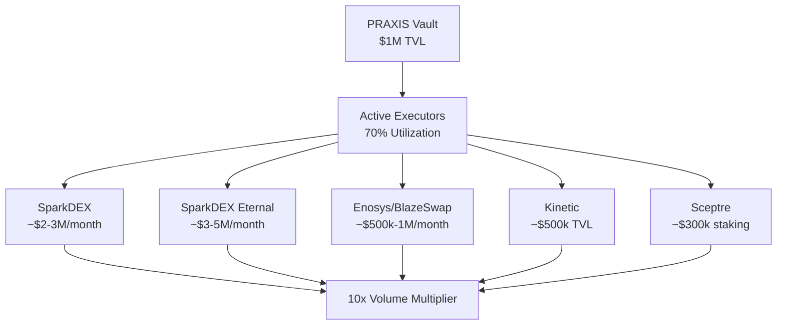
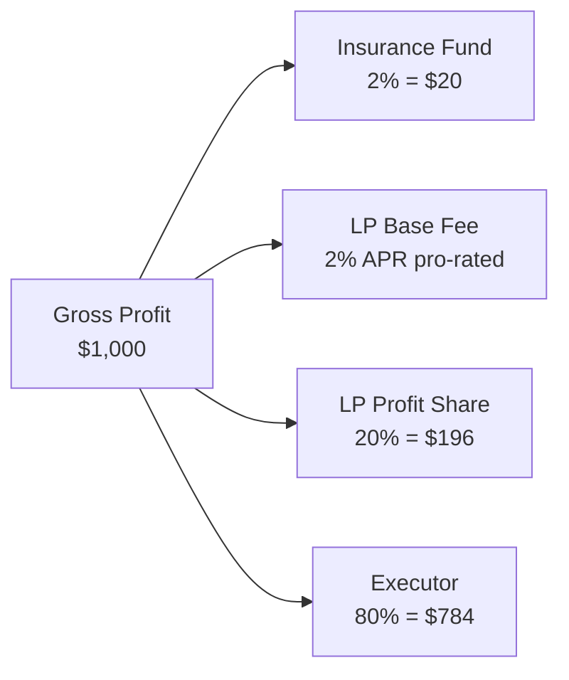

# PRAXIS

**The Execution Rights Protocol for Flare**

> Trade with capital you don't own. Never default. Never get liquidated.

[](https://flare.network)
[](https://soliditylang.org/)
[]()
[](LICENSE)

---

## Overview

PRAXIS introduces a new DeFi primitive: **Execution Rights**. Instead of lending tokens where borrowers take custody and can default, PRAXIS leases *permission to execute strategies* over capital that never leaves the vault.

```
Traditional Lending:
  LP deposits -> Borrower takes custody -> Risk of default -> Overcollateralization required

PRAXIS Model:
  LP deposits -> Capital stays in vault -> Executor gets time-bound rights -> Smart contracts enforce limits
```

**Key insight:** You can use capital without owning it. Like a company credit card with spending limits, not cash in your pocket.

---

## The Problem

| Traditional DeFi Lending | Impact |
|--------------------------|--------|
| Borrowers take custody of assets | Default risk, requires overcollateralization |
| Capital inefficiency | Only those with existing wealth can borrow |
| Fixed interest rates | LPs miss out on trading profits |
| Liquidation cascades | Market volatility causes systemic risk |
| Skill doesn't matter | Skilled traders without capital can't participate |

## The PRAXIS Solution

| Problem | PRAXIS Solution |
|---------|-----------------|
| Default risk | Capital never leaves vault - impossible to default |
| Overcollateralization | Reputation-based access with stake requirements |
| Fixed yields only | Alpha sharing: 2% base + 20% of executor profits |
| Skilled traders excluded | Pure skill-based capital access through reputation tiers |

---

## How It Works

### For LPs (Capital Providers)



1. **Deposit** stablecoins/FAssets into ExecutionVault (ERC-4626)
2. **Earn** guaranteed 2% APR base fee + 20% of executor profits
3. **Safety**: Capital stays in vault, 30% reserve always maintained
4. **Withdraw** anytime (subject to 70% max utilization)

### For Executors (Traders)



1. **Start small** at Tier 0 ($100 max), build reputation through profitable settlements
2. **Request ERT** (Execution Rights Token) - an NFT encoding your permissions
3. **Execute** through whitelisted protocols (SparkDEX, Kinetic, Sceptre, Eternal)
4. **Settlement** uses FTSO prices - trustless, non-manipulable

### Reputation Tiers

| Tier | Name | Max Capital | Stake Required | Max Drawdown |
|------|------|-------------|----------------|--------------|
| 0 | Unverified | $100 | 50% | 20% |
| 1 | Novice | $1,000 | 25% | 15% |
| 2 | Verified | $10,000 | 15% | 10% |
| 3 | Established | $100,000 | 10% | 10% |
| 4 | Elite | $500,000+ | 5% | 15% |

**Key invariant:** `Stake % >= Max Drawdown %` at every tier. Executor stake always covers maximum possible loss.

---

## Architecture



### Contract Overview

| Contract | Purpose |
|----------|---------|
| **PraxisGateway** | Unified entry point for all protocol interactions |
| **ExecutionVault** | ERC-4626 vault holding LP capital |
| **ExecutionRightsNFT** | ERC-721 tokens encoding executor permissions |
| **ExecutionController** | Validates actions against ERT constraints |
| **SettlementEngine** | Calculates PnL using FTSO, distributes fees |
| **ReputationManager** | Tracks executor tiers and progression |
| **PositionManager** | Tracks all open/closed positions per ERT |

---

## Safety Architecture

PRAXIS implements 6 layers of protection:



### Why Griefing Doesn't Work

```
Attack attempt: "I'll grief $100k from the vault"

Without reputation:
  - Request $100k, lose 10% = $10k, walk away
  - Cost to attacker: $0
  - LP loss: $10k

With PRAXIS reputation:
  - Start at Tier 0 ($100 max)
  - Work 3 months of profitable trading
  - Reach Tier 3 ($100k), stake $10k (10%)
  - Intentionally lose 10% = $10k
  - Executor loses their $10k stake
  - LP loss: $0

Result: Attacker spent 3 months and lost $10k to grief $0.
```

---

## Flare Integration

PRAXIS leverages Flare's unique infrastructure:



| Feature | Use in PRAXIS |
|---------|---------------|
| **FTSO** | Trustless price feeds for settlement PnL calculation |
| **FDC** | Cross-chain event triggers (e.g., BTC payment → auto-stake) |
| **FAssets** | Native BTC/XRP/DOGE trading without bridges |

---

## Zero-Knowledge Privacy

Executors can optionally hide strategy details using ZK proofs:



| Circuit | Purpose |
|---------|---------|
| **private_swap** | Prove swap validity without revealing pairs/amounts |
| **private_yield** | Prove yield strategy without revealing protocol/deposits |
| **private_perp** | Prove perpetual position without revealing direction/leverage |
| **private_settlement** | Prove settlement without revealing trade history |

Built with **Noir circuits** and **Groth16 proofs**.

---

## Ecosystem Synergy

PRAXIS doesn't compete with Flare DeFi - it **drives volume** to existing protocols:



**Every $1 in PRAXIS TVL generates 10x+ volume across the Flare ecosystem.**

---

## Project Structure

```
praxis/
├── web3/                    # Smart Contracts (Hardhat 3)
│   ├── contracts/
│   │   ├── core/           # 14 core protocol contracts
│   │   ├── zk/             # ZK verifier contracts (5)
│   │   ├── oracles/        # FTSO & FDC integration
│   │   ├── adapters/       # Protocol adapters
│   │   └── interfaces/     # Contract interfaces (15+)
│   ├── test/               # 1,216+ tests
│   └── scripts/            # Deployment automation
│
├── client/                  # Frontend (Next.js)
│   ├── app/dashboard/      # Main application
│   │   ├── lp-portal/      # LP deposit/withdraw
│   │   ├── executor/       # Executor portal
│   │   ├── erts/           # ERT management
│   │   ├── swap/           # DEX aggregator
│   │   ├── yield/          # Yield strategies
│   │   ├── perps/          # Perpetual trading
│   │   └── private-execution/  # ZK actions
│   ├── components/         # 15+ React modules
│   └── lib/zk/             # ZK proof generation
│
├── circuits/               # Noir ZK circuits
│   ├── private_swap/
│   ├── private_yield/
│   ├── private_perp/
│   └── private_settlement/
│
└── docs/
    ├── whitepaper.md       # Full protocol design
    ├── prd.md              # Product requirements
    └── implementation_plan.md
```

---

## Quick Start

### Prerequisites

- Node.js >= 18
- npm or yarn

### Smart Contracts

```bash
cd web3
npm install
npx hardhat compile
npx hardhat test
```

### Frontend

```bash
cd client
npm install
npm run dev
```

### Deploy to Coston2 Testnet

```bash
cd web3
npx hardhat keystore set COSTON2_PRIVATE_KEY
npx hardhat run scripts/deploy/deployAll.ts --network coston2
```

---

## Deployed Contracts (Coston2 Testnet)

### Core Protocol

| Contract | Address |
|----------|---------|
| PraxisGateway | `0xbF96360cEB79235AB26b83c60c2588a109f4F7b0` |
| ExecutionVault | `0xaDd37200a615516a703Af67ED77AB6d9AB7f6a25` |
| ExecutionRightsNFT | `0x67a1bD7abFe97B0B40Da7dd74712e106F80e4017` |
| ExecutionController | `0xab40B51AF279Fd4Fa6031a7C9548Cf8463da3017` |
| SettlementEngine | `0x348C5E5e26fba7086d863B708142e7f48c0cBe84` |
| ReputationManager | `0xE1bad1a7971BD540A243806002f978863B528a73` |
| PositionManager | `0xD762Cc16f44eCC0Dbc11D49Df8431cbe04527648` |

### Safety & Routing

| Contract | Address |
|----------|---------|
| FlareOracle | `0x0979854b028210Cf492a3bCB990B6a1D45d89eCc` |
| FDCVerifier | `0xe667bEf52f1EAD93Cb0375639a4eA36001d4edf3` |
| SwapRouter | `0x65e72849DD87978023Fef664a39b1FE0576c5C9D` |
| UtilizationController | `0xdf08ab2Fed1046d383f2d8A7a6cE067b6b37EBC9` |
| CircuitBreaker | `0x556a3C56014F3469cA2603015d360e8Db09EBF7e` |
| ExposureManager | `0x217b9226cf843497BcC09ee442fC77600026dbFe` |
| InsuranceFund | `0xDe0724bE704F3c889596D03D52aFc2688B5FF645` |

### Mock Tokens

| Token | Address |
|-------|---------|
| MockUSDC | `0x9401FCe40Cb84b051215d96e85BecD733043a33D` |
| MockWFLR | `0x0a22b6e2f0ac6cDA83C04B1Ba33aAc8e9Df6aed7` |
| MockFXRP | `0x2859b97217cF2599D5F1e1c56735D283ec2144e3` |
| MockFBTC | `0x2E124DEaeD3Ba3b063356F9b45617d862e4b9dB5` |
| MockFDOGE | `0xeAD29cBfAb93ed51808D65954Dd1b3cDDaDA1348` |
| MockSFLR | `0x8C6057145c1C523e08D3D1dCbaC77925Ee25f46D` |

---

## Development Status

| Phase | Name | Status | Tests |
|-------|------|--------|-------|
| 1 | Oracle Foundation | Complete | 52 unit + 15 integration |
| 2 | DEX Adapters | Complete | SparkDEX, Enosys, BlazeSwap |
| 3 | Yield Adapters | Complete | Kinetic, Sceptre |
| 4 | Perpetual Adapters | Complete | SparkDEX Eternal |
| 5 | FAssets Support | Complete | FXRP, FBTC, FDOGE |
| 6 | Vault & Rights | Complete | 1,061 tests |
| 7 | Settlement Engine | 95% | Integration ongoing |
| 8 | Security Audit | Planned | Post-testnet |
| 9 | Mainnet Launch | Planned | After audit |

**Total Tests:** 1,216+ passing

---

## Technology Stack

| Layer | Technology |
|-------|------------|
| **Smart Contracts** | Solidity ^0.8.28, Hardhat 3, OpenZeppelin |
| **Frontend** | Next.js (App Router), React 18+, TypeScript, Tailwind |
| **Web3** | Wagmi + Viem |
| **Cryptography** | Noir circuits, Groth16 proofs, Pedersen hashing |
| **Oracles** | FTSO v2, Flare Data Connector |

---

## Documentation

| Document | Description |
|----------|-------------|
| [Whitepaper](docs/whitepaper.md) | Full protocol design and economics |
| [PRD](docs/prd.md) | Product requirements and specifications |
| [Implementation Plan](docs/implementation_plan.md) | Technical roadmap and milestones |
| [Fork Testing Guide](docs/FORK_TESTING_GUIDE.md) | Testing against Flare mainnet |

---

## Economic Model

### Fee Flow



### Example: $10,000 ERT for 30 Days, 10% Profit

| Component | Amount |
|-----------|--------|
| Gross Profit | $1,000 |
| LP Base Fee (2% APR, 30 days) | $16.44 |
| Insurance Fund (2% of gross) | $20 |
| LP Profit Share (20%) | $196 |
| Executor Profit (80%) | $784 |
| **LP Total Return** | **$212.44 (2.12%)** |

---

## Contributing

Contributions are welcome! Please:

1. Fork the repository
2. Create a feature branch
3. Write tests for new functionality
4. Submit a pull request

---

## License

MIT License - see [LICENSE](LICENSE) for details.

---

## Links

- [Flare Network](https://flare.network/)
- [FTSO Documentation](https://docs.flare.network/tech/ftso/)
- [FDC Documentation](https://docs.flare.network/tech/fdc/)
- [SparkDEX](https://sparkdex.ai/)

---

<p align="center">
  <strong>Built for Flare. Powered by FTSO. Routes to SparkDEX, Kinetic, Sceptre, Eternal.</strong>
</p>
