# PRAXIS: The Execution Rights Protocol

**Trade with capital you don't own. Never default. Never get liquidated.**

---

## Table of Contents

1. [Executive Summary](#executive-summary)
2. [The Problem](#the-problem)
3. [The Solution](#the-solution)
4. [How It Works](#how-it-works)
5. [Why Flare](#why-flare)
6. [How PRAXIS Complements Flare DeFi](#how-praxis-complements-flare-defi)
7. [Liquidity Routing Architecture](#liquidity-routing-architecture)
8. [The Economic Model](#the-economic-model)
9. [Safety Architecture](#safety-architecture)
10. [Technical Overview](#technical-overview)
11. [Zero-Knowledge Privacy Layer](#zero-knowledge-privacy-layer)
12. [Roadmap](#roadmap)
13. [Addressing Common Concerns](#addressing-common-concerns)

---

## Executive Summary

PRAXIS is an **Execution Rights Protocol** built on Flare that fundamentally reimagines how capital is accessed in DeFi. Instead of traditional lending where borrowers take custody of assets and risk default, PRAXIS **leases execution rights** over capital while maintaining vault custody and smart contract-enforced constraints.

**Core Innovation:**


**Key principle:** Capital never leaves the vault. Only execution is delegated.

---

## The Problem

### DeFi Lending is Broken

Today's DeFi lending has a fundamental issue: **borrowers take custody of assets**.

When someone borrows from a lending protocol like Aave or Compound, they walk away with the tokens. The protocol hopes they'll return them (plus interest), but has no guarantee. To protect against default, protocols require **overcollateralization** — you must deposit $150 worth of assets to borrow $100.

This creates several problems:

| Problem | Impact |
|---------|--------|
| **Capital inefficiency** | Only people who already have money can borrow |
| **Liquidation risk** | Market volatility can wipe out your collateral |
| **Limited access** | Skilled traders without capital can't participate |
| **No alpha sharing** | LPs earn fixed rates, miss out on trading profits |

### The Missed Opportunity

Imagine a skilled trader who can consistently make 15% returns. Today, they have two options:

1. **Trade their own capital** — Limited by personal wealth
2. **Borrow with collateral** — Need existing assets, risk liquidation

What they *can't* do is access capital based purely on their skill. There's no way for capital providers to say: "Here's $100k, show me what you can do, and we'll split the profits."

**Until now.**

---

## The Solution

### Introducing Execution Rights

PRAXIS doesn't lend you money. It **leases you the right to use money**.

Here's the key insight: **You can use capital without owning it.**


### The Core Innovation

When you get Execution Rights in PRAXIS:

1. **Capital never leaves the vault** — It stays locked, safe
2. **You get a permission token (ERT)** — An NFT encoding what you can do
3. **Smart contracts execute on your behalf** — Within strict limits
4. **Profits are split fairly** — You keep 80%, LP gets 20%

It's like being given a company credit card with spending limits, rather than being handed cash.

---

## How It Works

### For LPs (Capital Providers)


**LP Benefits:**
- Guaranteed 2% base APR (paid regardless of executor performance)
- 20% profit share (upside exposure to skilled trading)
- Capital never transferred to third parties
- 30% reserve ensures withdrawal liquidity

### For Executors (Traders/Bots)


**ERT Contains:**
- Capital limits
- Max leverage (e.g., 5x)
- Max drawdown (e.g., 10%)
- Whitelisted protocols/assets
- Required stake amount
- Duration (1 hour - 30 days)

### A Real Example

**Scenario:** Alice is a skilled trader. Bob has capital but no trading skills.

```
Without PRAXIS:
  - Alice can't access Bob's capital (no collateral)
  - Bob's capital sits in a 5% yield farm
  - Both miss out

With PRAXIS:
  - Alice requests $10,000 execution rights for 7 days
  - Alice stakes $1,500 (15% at Tier 2)
  - Alice runs a profitable strategy, makes $600 profit

  Settlement:
    - LP (Bob) gets: $1.92 base fee + $120 (20% of profit) = $121.92
    - Executor (Alice) gets: $480 (80% of profit)
    - Alice's stake returned in full
    - Capital returned to vault

  Result:
    - Bob earned 12%+ APY on his capital (vs 5% in yield farm)
    - Alice made $480 with only $1,500 of her own money
    - Both win
```

---

## Why Flare

PRAXIS is built specifically for Flare because Flare has infrastructure no other chain provides.

```mermaid
flowchart TB
    subgraph Flare["Flare Infrastructure"]
        FTSO[FTSO<br/>63+ asset prices<br/>90s updates<br/>Decentralized]
        FDC[FDC<br/>Cross-chain verification<br/>BTC/ETH events]
        FAssets[FAssets<br/>FXRP, FBTC, FDOGE<br/>Native cross-chain]
    end

    subgraph PRAXIS["PRAXIS Usage"]
        Settlement[Settlement<br/>Trustless PnL calculation]
        Triggers[Cross-chain triggers<br/>BTC payment → strategy]
        Trading[Native trading<br/>No bridges needed]
    end

    FTSO --> Settlement
    FDC --> Triggers
    FAssets --> Trading
```



### FTSO (Flare Time Series Oracle)

**What it does:** Provides trustless, decentralized price feeds for 63+ assets.

**Why PRAXIS needs it:** Settlement requires calculating profit/loss. We need prices that:
- Can't be manipulated by executors
- Update frequently (every 90 seconds)
- Are available for all assets traded

FTSO gives us this. On other chains, we'd need to trust a centralized oracle — a critical security risk.

```
At settlement:
  1. Query FTSO for all asset prices
  2. Calculate PnL = (final value) - (initial capital)
  3. Distribute fees trustlessly

No one can manipulate their reported profits.
```

### FDC (Flare Data Connector)

**What it does:** Brings verified external data (Bitcoin transactions, Ethereum events) on-chain.

**Why PRAXIS needs it:** Enables cross-chain triggered execution.

```
Example use case:
  "When my BTC payment confirms on Bitcoin mainnet,
  automatically swap to FXRP and stake for yield"

How it works:
  1. User sets up ERT with FDC trigger condition
  2. BTC payment happens on Bitcoin
  3. Anyone submits FDC proof to PRAXIS
  4. FDCVerifier confirms the proof
  5. Strategy executes automatically
```

### FAssets (FXRP, FBTC, FDOGE)

**What they are:** Trustless representations of BTC, XRP, DOGE on Flare.

**Why PRAXIS needs them:** They're the most liquid non-FLR assets on Flare. PRAXIS enables strategies like:
- FXRP yield farming
- BTC-backed trading strategies
- Cross-chain arbitrage

---

## How PRAXIS Complements Flare DeFi

### What We Don't Do (Avoiding Overlap)

| Existing Protocol | Their Focus | What PRAXIS Doesn't Do |
|-------------------|-------------|------------------------|
| earnXRP | Yield aggregation | Compete on yield strategies |
| Kinetic | Lending/borrowing | Provide lending services |
| SparkDEX | DEX trading | Run our own liquidity pools |
| Sceptre | Liquid staking | Offer staking products |

### What We Do (Driving Volume)

PRAXIS is an **execution layer** that uses existing protocols. Every executor action generates:


We don't compete with these protocols. **We drive business to them.**

### The Ecosystem Multiplier Effect


---

## Liquidity Routing Architecture

### We Don't Bootstrap Liquidity — We Route It

This is critical: **PRAXIS doesn't need its own liquidity pools.**

Traditional DeFi protocols face the "cold start" problem — they need to attract liquidity providers before they can offer any service. A new DEX needs LP deposits. A new lending protocol needs lenders.

PRAXIS is different. We tap into **existing liquidity** across the Flare ecosystem:


### How the SwapRouter Works

When an executor wants to swap 10,000 USDC → FLR:


### Multi-Hop Routing for Deep Liquidity

Sometimes the best path isn't direct. The SwapRouter handles multi-hop routes:


The SwapRouter finds this path automatically. Each protocol along the way earns fees.

### Perpetual Trading Through SparkDEX Eternal

SparkDEX Eternal is Flare's perpetual futures exchange, offering up to 100x leverage. PRAXIS integrates directly:


### Volume Multiplier Effect

Here's why PRAXIS is valuable to the ecosystem. A single executor strategy can generate massive volume:

```
Example: $10,000 execution rights for 7 days

Day 1:
  • Swap $10,000 USDC → FLR (SparkDEX)         → $10k volume
  • Stake FLR → sFLR (Sceptre)                 → $10k TVL

Day 3:
  • Unstake sFLR → FLR (Sceptre)               → $10k volume
  • Open 3x long FLR perp (Eternal)            → $30k notional

Day 5:
  • Close perp position (Eternal)              → $30k notional
  • Swap FLR → FXRP (Enosys)                   → $11k volume

Day 7:
  • Swap FXRP → USDC for settlement (SparkDEX) → $12k volume

TOTAL VOLUME FROM $10k CAPITAL:
  • DEX swaps: ~$43,000
  • Perp volume: ~$60,000
  • Staking TVL-days: ~$20,000

That's 10x+ volume multiplication.
```

### The No-Liquidity-Bootstrap Advantage


This is why PRAXIS is **realistic and practical** — we don't need to solve the liquidity problem because we use liquidity that already exists.

---

## The Economic Model

### Alpha Sharing: Why LPs Would Deposit

**The question:** Why deposit in PRAXIS vs earnXRP (5% fixed) or Kinetic (4% lending)?

**The answer:** PRAXIS offers something no one else does — **exposure to skilled trading**.


**KEY INSIGHT:** LPs get UPSIDE EXPOSURE to skilled trading without doing the trading themselves.

### The Math for Executors

```
Executor requests $10,000 for 30 days:

  Upfront cost: $10,000 × 2% × (30/365) = $16.44

  If they make 5% profit ($500):
    LP share (20%): $100
    Executor keeps (80%): $400
    Net to executor: $400 - $16.44 = $383.56

  Effective return on stake (at Tier 2, 15% = $1,500):
    $383.56 / $1,500 = 25.6% in 30 days

This is why skilled traders want execution rights.
```

### Fee Flow Summary


---

## Safety Architecture

### The Problem We're Solving

Without protection, a market crash could cause:
- All executors lose simultaneously
- Vault bleeds capital rapidly
- LPs lose trust and withdraw
- Protocol death spiral

### Multi-Layer Protection


### Reputation Tier System

New executors can't request $100k on day one. They must earn trust:

| Tier | Name | Max Capital | Stake Required | Max Drawdown |
|------|------|-------------|----------------|--------------|
| 0 | Unverified | $100 | 50% | 20% |
| 1 | Novice | $1,000 | 25% | 15% |
| 2 | Verified | $10,000 | 15% | 10% |
| 3 | Established | $100,000 | 10% | 10% |
| 4 | Elite | $500,000+ | 5% | 15% |

**Key Invariant:** Stake % ≥ Max Drawdown % at every tier.

This means: **The executor's stake always covers the maximum possible loss.**

### Tier Progression


### Why Griefing Doesn't Work


---

## Technical Overview

### Contract Architecture


### What Gets Enforced On-Chain

Every executor action is validated against their ERT:


**If any check fails, the transaction reverts.** There's no way to bypass constraints.

### Deployed Contracts (Coston2 Testnet)

| Contract | Address | Purpose |
|----------|---------|---------|
| PraxisGateway | `0xbF96360cEB79235AB26b83c60c2588a109f4F7b0` | Unified entry point |
| ExecutionVault | `0xaDd37200a615516a703Af67ED77AB6d9AB7f6a25` | ERC-4626 vault |
| ExecutionRightsNFT | `0x67a1bD7abFe97B0B40Da7dd74712e106F80e4017` | Permission tokens |
| ExecutionController | `0xab40B51AF279Fd4Fa6031a7C9548Cf8463da3017` | Rule enforcement |
| SettlementEngine | `0x348C5E5e26fba7086d863B708142e7f48c0cBe84` | PnL calculation |
| ReputationManager | `0xE1bad1a7971BD540A243806002f978863B528a73` | Tier management |
| FlareOracle | `0x0979854b028210Cf492a3bCB990B6a1D45d89eCc` | FTSO integration |
| FDCVerifier | `0xe667bEf52f1EAD93Cb0375639a4eA36001d4edf3` | Cross-chain proofs |
| SwapRouter | `0x65e72849DD87978023Fef664a39b1FE0576c5C9D` | DEX aggregation |

---

## Zero-Knowledge Privacy Layer

### Why Privacy Matters

Skilled traders have a competitive advantage: their strategies. If everyone could see what a successful executor is doing, they'd copy the strategy and eliminate the edge.

PRAXIS offers optional ZK privacy for executors who want to protect their alpha.

### ZK Architecture


### Noir Circuits

| Circuit | Purpose |
|---------|---------|
| **private_swap** | Proves a swap occurred without revealing token pairs or amounts |
| **private_yield** | Proves yield strategy execution without revealing protocols/deposits |
| **private_perp** | Proves perpetual position without revealing direction/leverage |
| **private_settlement** | Proves settlement completed without revealing trade history |
| **ert_ownership** | Proves ERT ownership without revealing to public |

### Implementation

- **Language**: Noir (zero-knowledge circuit language)
- **Proof Type**: Groth16 (zk-SNARKs)
- **Key Features**:
  - Merkle tree commitments for adapter/asset whitelists
  - Blinding factors for privacy
  - Pedersen hashing for commitment generation
  - Public commitments with private inputs

---

## Roadmap

### Phased Implementation

```mermaid
flowchart LR
    subgraph PhaseA["Phase A: Self-Execution"]
        A1[Users deposit AND execute own strategies]
        A2[Use cases: Auto-DCA, one-click yield]
        A3[No third-party trust needed]
        A4[Proves: Vault, constraints, settlement work]
    end

    subgraph PhaseB["Phase B: Whitelisted Executors"]
        B1[Vetted traders access LP capital]
        B2[Requires: Reputation + stake]
        B3[Use cases: Professional trading]
        B4[Proves: Third-party execution safe]
    end

    subgraph PhaseC["Phase C: Open Marketplace"]
        C1[Permissionless execution rights]
        C2[LPs choose risk parameters]
        C3[Market determines fees]
        C4[Full alpha marketplace]
    end

    PhaseA --> PhaseB --> PhaseC
```

### Milestones

| # | Milestone | Status | Description |
|---|-----------|--------|-------------|
| 1 | Oracle Foundation | ✅ Complete | FTSO + FDC integration, 52 unit + 15 integration tests |
| 2 | DEX Adapters | ✅ Complete | SparkDEX, Enosys, BlazeSwap with multi-hop routing |
| 3 | Yield Adapters | ✅ Complete | Kinetic (lending) + Sceptre (staking) |
| 4 | Perpetual Adapters | ✅ Complete | SparkDEX Eternal with leverage caps |
| 5 | FAssets Support | ✅ Complete | FXRP, FBTC, FDOGE trading enabled |
| 6 | Vault & Rights System | ✅ Complete | ExecutionVault, ExecutionRightsNFT, reputation tiers |
| 7 | Settlement Engine | 🟡 95% | Core complete, final integration ongoing |
| 8 | Security Audit | ⬜ Planned | Slither, Mythril, manual review |
| 9 | Mainnet Launch | ⬜ Planned | After audit completion |

### Test Coverage

- **Unit Tests**: 1,216 tests passing
- **Phase 6 Unit Tests**: 1,061 tests passing
- **Integration Tests (Flare Mainnet Fork)**: 29 tests passing
- **ZK Circuits**: Private swap, yield, perp, settlement implemented

---

## Addressing Common Concerns

### "Isn't this just lending with extra steps?"

No. The fundamental difference:

| Lending | PRAXIS |
|---------|--------|
| Borrower takes custody | Capital never leaves vault |
| Can default | Default impossible |
| Requires collateral | Based on reputation + stake |
| Fixed interest | Profit sharing |

Lending gives you money and hopes you return it. PRAXIS gives you permission to use money that stays locked.

### "Why would LPs risk their capital?"

1. **Downside is capped** — Max drawdown enforced by smart contracts
2. **Executor stake covers losses** — At every tier, stake > max drawdown
3. **Insurance fund backup** — 2% of profits create safety net
4. **Diversification** — Capital spread across many executors
5. **Upside exposure** — 20% of profits is significant alpha sharing

### "What if executors collude?"

1. **Reputation system** — Takes months to reach high tiers
2. **Exposure limits** — Can't all bet the same direction
3. **Circuit breaker** — Pauses at 5% daily loss
4. **Stake economics** — Collusion costs more than it gains

### "Why build on Flare specifically?"

1. **FTSO** — Trustless prices for settlement (no oracle trust)
2. **FDC** — Cross-chain triggers (no bridge trust)
3. **FAssets** — Native BTC/XRP/DOGE exposure (no wrapped token trust)
4. **Ecosystem gap** — No alpha-sharing primitive exists on Flare

### "How does this not compete with existing protocols?"

PRAXIS **uses** existing protocols, it doesn't compete:

- We route swaps through SparkDEX/Enosys/BlazeSwap
- We stake through Sceptre
- We lend through Kinetic
- We trade perps through Eternal

Every dollar of TVL in PRAXIS generates volume for the ecosystem.

---

## Summary

### What PRAXIS Is

- An **Execution Rights Protocol** — permission to use capital, not custody of it
- An **Alpha Sharing Platform** — LPs earn from skilled trading, not just fixed yields
- A **Liquidity Router** — routes all trades through SparkDEX, Enosys, BlazeSwap, Kinetic, Sceptre, and Eternal
- A **Flare Infrastructure Showcase** — built on FTSO, FDC, and FAssets
- An **Ecosystem Multiplier** — drives volume to all Flare DeFi protocols

### What PRAXIS Isn't

- A lending protocol (no custody transfer)
- A yield aggregator (strategies are custom per executor)
- A competitor to existing protocols (we route to them)
- A trust-based system (smart contracts enforce everything)
- A liquidity bootstrapper (we use existing liquidity)

### The One-Liner

**PRAXIS lets skilled traders use other people's capital through smart contract enforced permissions, routing all execution through existing Flare DeFi protocols, creating a marketplace where LPs share in trading profits without doing the trading themselves.**

### Projected Ecosystem Impact

```mermaid
flowchart TD
    TVL[PRAXIS $1M TVL<br/>70% utilization<br/>10x volume multiplier] --> Volume[Monthly Volume<br/>Routed to Flare DeFi]

    Volume --> SparkDEX[SparkDEX spot<br/>~$2-3M]
    Volume --> Eternal[SparkDEX Eternal<br/>~$3-5M leveraged]
    Volume --> Other[Enosys/BlazeSwap<br/>~$500k-1M]
    Volume --> Kinetic[Kinetic<br/>~$500k TVL]
    Volume --> Sceptre[Sceptre<br/>~$300k staking]

    SparkDEX --> Total[Total: $7-10M monthly<br/>from $1M TVL]
    Eternal --> Total
    Other --> Total
    Kinetic --> Total
    Sceptre --> Total

    Total --> Impact[Every PRAXIS dollar<br/>works 10x harder for Flare]
```

### Key Takeaways

1. **No Overlap** — We don't compete with SparkDEX, Kinetic, Sceptre, or anyone else
2. **Pure Volume Driver** — Every executor action generates fees for existing protocols
3. **No Liquidity Bootstrap Needed** — We tap into existing DEX/lending liquidity
4. **Showcases Flare Infrastructure** — FTSO for settlement, FDC for cross-chain, FAssets for trading
5. **Novel Primitive** — Execution rights don't exist anywhere else; this is new DeFi infrastructure
6. **Realistic Path** — Phased rollout from self-execution to open marketplace

---

*Built for Flare. Powered by FTSO. Routes to SparkDEX, Kinetic, Sceptre, Eternal.*
